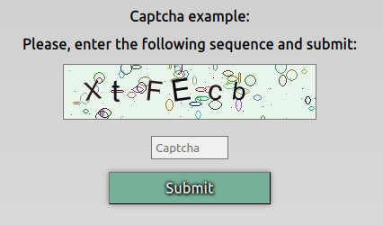

#  php-captcha 

> Pure PHP text/image based Captcha

This is a pure PHP captcha that uses sessions to store a randon sequence of characters and GD2 library to render an image with it.

## Screenshot

## Replit
<a href="https://replit.com/@lugui20/php-captcha">> Run this code on    https://replit.com/@lugui20/php-captcha</a>
